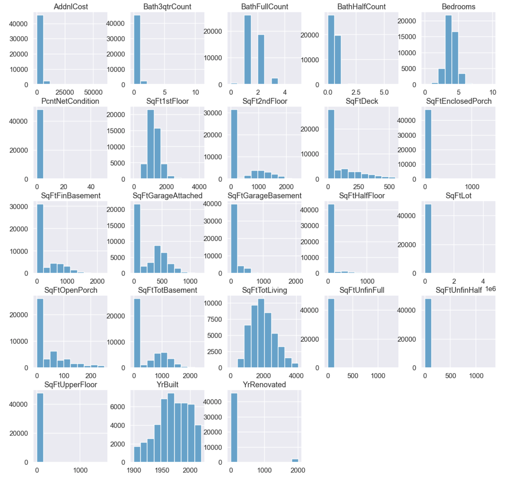
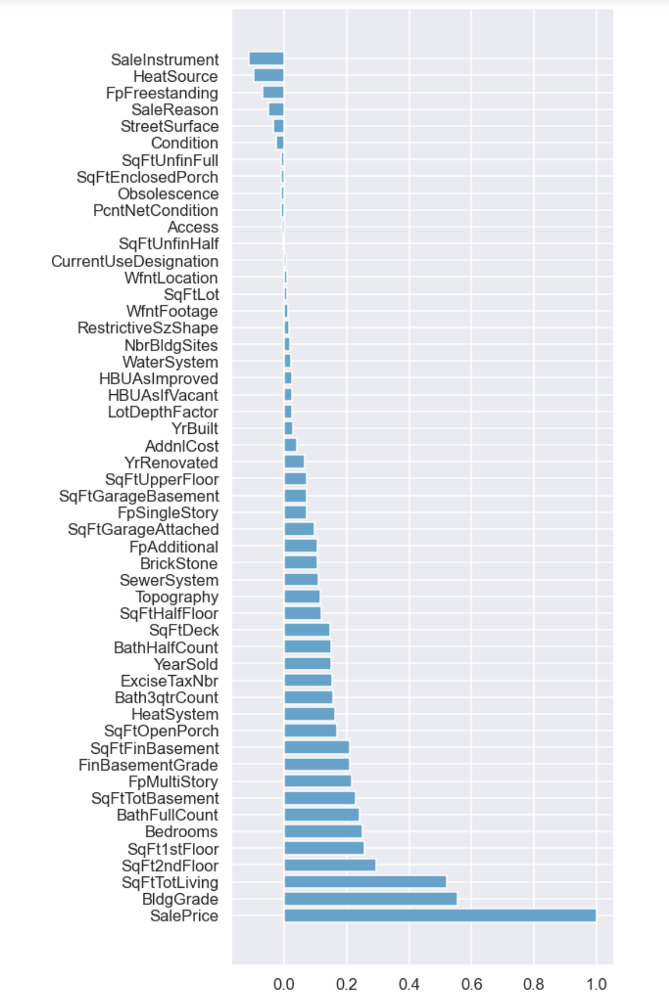
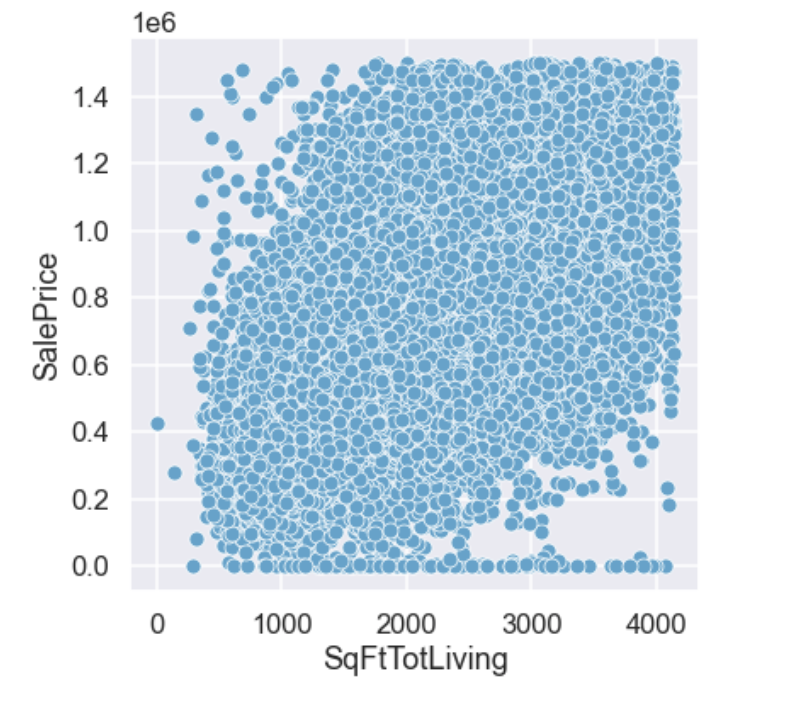
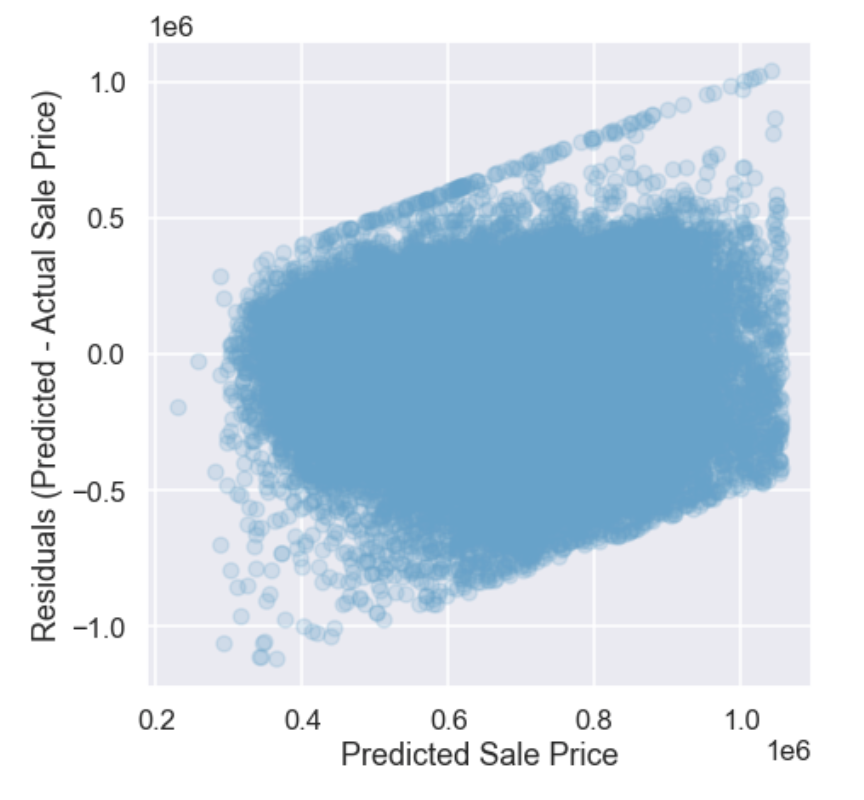
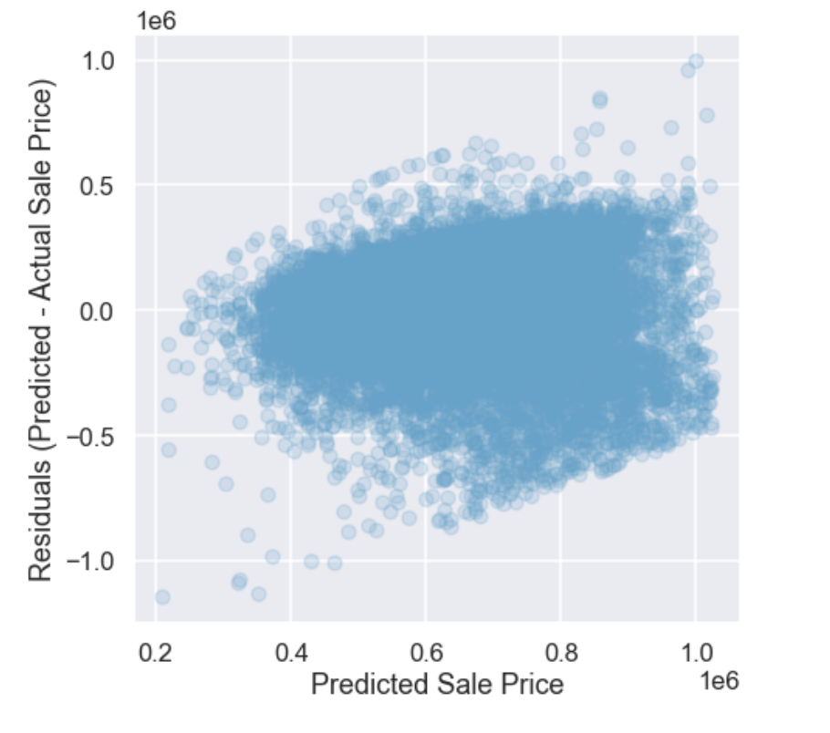
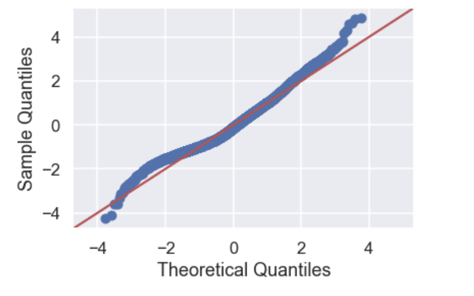
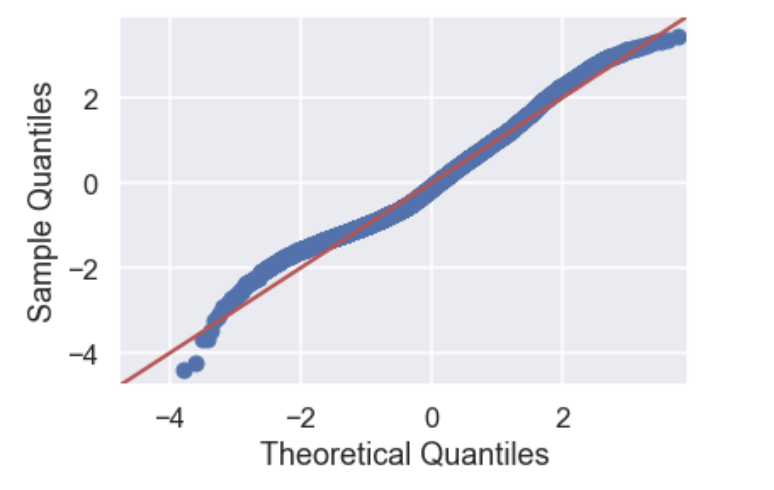

# King County Home Price Analysis

This repository offers an analysis of factors that influence housing prices in King County, WA

## This Repository

### Repository Directory

```
├── README.md        <-- Main README file explaining the project's business case,
│                        methodology, and findings
│
├── data             
│   ├── processed    <-- Processed (combined, cleaned) data used for modeling
│   └── raw          <-- Original (immutable) data dump
│
├── figures          <-- Graphs and figures used in README
│                        methodology, and findings
├── notebooks        
│   ├── exploratory  <-- Unpolished exploratory data analysis (EDA) notebooks
│   └── report       <-- Polished final notebook(s)
│
├── references       <-- Data dictionaries
│
└── reports          <-- Generated analysis (including presentation.pdf)
    └── figures      <-- Generated graphics and figures to be used in reporting
```

### Quick Links

1. [Data Preparation Notebook](notebooks/exploratory/data_preparation.ipynb)
2. [Final Analysis Notebook](notebooks/exploratory/KingsCountyHomePriceAnalysis.ipynb)
3. [Presentation Slides](presentation.pdf)


## Business Understanding

A client in King County, WA wants to advise homeowners on **home improvement projects** that will **add to the sale value of their homes.**

## Data Understanding

The datasets for this projects were provided by **the Kings County Department of Assessments.** Three of the datasets contain **property data** and a fourth represents information about **administrative codes.** All **three datasets with property data were merged into one dataframe** in order to build a baseline model.

To investigate the continuous variables of the data closer, the **distribution** for each feature was inspected.

### Histogram of All Continuous Features


The histograms show that most of the variables are **not normally distributed** and are **positively skewed**. The columns `SqFt1stFloor`, `Bedrooms`, `YrBuilt` and `SqFtTotLiving` are the closest ones to **normal distributon.**

Considering that `SalePrice` is a target variable for the analysis, a **bar graph** and **heatmap** plots were built to find the features that are **most correlated with the target.**

### Correlation Bar Graph for All Features


Graph shows that **most correlated features** are `SalePrice`, `BldgGrade`, `SqFtTotLiving`, `SqFt1stFloor`, `SqFt2ndFloor` and `BathFullCount`.

Lastly, to build a baseline model with only one feature that is the most correlated with target, the scatterplot was generated with target variable `SalePrice` and `SqFtTotLiving` feature.

### Correlation Between `SalePrice` and `SqFtTotLiving`


The graph indeed shows **loose linearity** between a feature and a target.


## Data Preparation

Before building the first model, the data was **cleaned from outliers in continious variables**, like `SqFtOpenPorch`, `SqFtDeck`, `SqFtGarageAttached`, `SqFtTotBasement`, `SqFtTotLiving`. As for the target variable `SalePrice`, the outliers were **dropped using the box plot** with a top threshold of $1 500 000.

After first linear regression baseline model with `SalePrice` as the target and `SqFtTotLiving` as a predictor, the **Error Plot** showed an **upward trend**, which might be explained by the **distribution of sale years**. Thus, all **observations that are not from 2019 were dropped from dataframe.**

### Error Plot with Full Data

### Error Plot with Data Only from 2019


After dropping the observations prior to 2019, an **improvement** can be seen on the Error Graphs. There is less upward trend on both of the graphs.

As the process of modeling progressed, a **square root transformation of target** `SalePrice` was done, which improved the model. While deeper investigation of the relationship between target and `SqFtTotLiving` feature,  **price per foot calculation** revealed another **set of outliers** that were later **dropped** from dataset. The result **improved the model's** `R-Square` from 0.272 to 0.281.

## Modeling

A baseline model was built using simple linear regression with `SalePrice` as the target and `SqFtTotLiving` predictor. The model went through multiple reformations of predictors and the data. The final model was built using a forward selection method with 12 837 observations.

### The final model contained the following predictors:
```
SqFtTotLiving_sqrt

SqFtEnclosedPorch

SqFtOpenPorch

Hot Water

Radiant

Elec BB

Gravity

Other (Heat System)
```
### Features that were dropped by forward selection method:
```
Forced Air 

Heat Pump

Floor - Wall
```

### Coefficients of Final Model:

**Intercept**                                -113564.804717

**SqFtTotLiving**                             17511.216420

**Hot_Water Heat System**                     123454.424132

**Radiant Heat System**                       164864.870792

**Electric BaseBoard Heat System**           -40260.197573

**Gravity Heat System**                       185602.551453

**SqFtOpenPorch**                             110.032856

**SqFtEnclosedPorch**                         160.245880

**Other Type of Heat System**                 101909.340237

## Evaluation

* The **coefficient of determination** in baseline model **increased from .272 to .3** in the final model. All **p-values** for the intercept and coefficients were **valid except for the** `Other` type of heating system. 
* The **linear relation p-value** in baseline model **decreased from 0.89 to 0.63** in final model, but still **met the linearity assumption.**
* None of the models passed normality assuption, meaning the **residuals were not normally distributed**. But final model showed the **better results on the Q-Q Plot.**

### Q-Q Plot of Baseline Model (Model 3)


### Q-Q Plot of Final Model (Model 8)


* The **Jarque_Bera p-value** was small and indicated **heteroscadasticity in the residuals** for both of the models. 
* While the condition number of the final model was large, the Variance Inflation Factor values for the features show **no multicollinearity**.
* All of the **coefficients** in the final model were **positively correlated with target variable** `SalePrice`, except the `Electric Baseboard` Heat System type. Considering that `Forced Air`, `Heat Pump` and `Floor-Wall` were included in the intercept, the `Electric Baseboard` Heat System have the **decrease in Sale Price** in relation to those Heat Systems. Houses with Electric Baseboard heat system on average were worth $40 000 less than houses equipped with Forced Air, Heat Pump or Floor-Wall heat systems.
* The **intercept is smaller** than all of the `Forced Air` heating when holding all other features constant. 
* While holding all other features constant, the coefficient for `SqFtTotLiving_sqrt` indicates that every **one foot increase in living space** will results on average in a **\$17 500** increase in `SalePrice`.
* **One square-foot increase** in  `SqFtOpenPorch`, while other predictors remain constans, on average **increases `SalePrice` by $110**. As for enclosed porch, `Sale Price` **increases by $160.25.**

**The final model showed better results than the baseline model.**


## Conclusion

# Recommendations for Home Improvements

Based on the information of the final model, the following **home improvement projects are recommended** to increase sale price:
* **Enclose porch**, because the price of the house increases by $160 per square feet if the porch is enclosed.
* **Upgrade to Forced Air** system from Electric baseboard Heat Systems due to price increase.
* **Increase the square feet of Living Space**, because every foot upgrade increases house price by $17 500.


## Next Steps

* Further investigate houses with fully open porches and fully enclosed porches. Find average price for both features.
* Increase the Living Space by converting BasementGarage to living area and invastigate how that would affect the sale price.
* Further analysis of heatsytem to calculate average sale price for each heatsytem.

